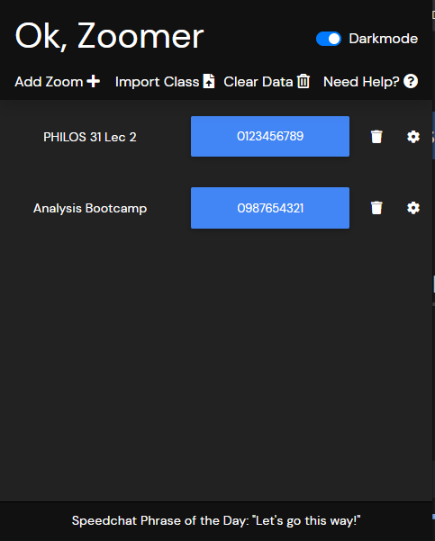

# ok-zoomer
Chrome extension to schedule Zoom class, and notify when the class is in progress.

## Backstory
Now that UCLA has become the University of Zoom, Los Angeles (UZLA), I personally have found it a bit annoying when I need to get to a class, but I hadn't had the presence of mind to save all my links in a central place. This inevitable results in me spaghetti-ing my Zoom links all over the place. I also have a friend who is planning on participating in 9 classes in Fall 2020 ([up from 6 last spring](readme-images/LotsOfClasses.png)). He was smart enough to store all the links in a folder of bookmarks but adding lots of class names, start times, etc. gets a bit ugly.

I'll also admit that sometimes because all I need to join a class is hit the Zoom link, I'll be like "ah, it's 12:55 and class isn't till 1. I've got some time". But then I'll find a [really interesting video](https://www.youtube.com/watch?v=JAhVxGMXhZk) and all of a sudden it's 1:05, and I didn't even notice because I'm too lazy to set up a calendar reminder.

## Installation
Please refer to [this installation PDF](InstallationInstructions.pdf), it's mainly images, and I think it would clutter up this readme.

## Main Functionality
There are three main functions this extension has:
1. The Class Planner: This extension turns planner boxes into links, as well as highlighting classes that are currently in progress so it's easily to join a the right class in a single click.
2. Notifications: Not only automatically shouting at you when classes start, but in a single click, it'll take you to the that class's Zoom.
3. The Popup: A quick way to access your Zoom links and edit individual class's settings like when they meet or changing password.
4. The Options Page: A place where all your added classes and Personal Entries can be gathered and displayed with their corresponding Zoom links/passwords.

By the way, I'll be __bolding__ bits I talk about that I'm definitely thinking about changing, or features I think would be interesting in adding. 

## The Class Planner

### Adding a class or personal entry
After installing the extension, the simplest way to add a class to Ok, Zoomer is to 
1. go to your [class planner](https://be.my.ucla.edu/ClassPlanner/ClassPlan.aspx#), where you'll see the tables that show classes in your plan have something extra now:

2. Clicking these extra plus buttons will bring up two prompts. First:
  
This is just asking for the link OR Zoom Room ID you want to associate with this class/personal entry. **It is preferable to add an ID over a simple link because it allows for faster joining.**
In fact if you add a Zoom Link of the following form:
```
https://ucla.zoom.us/j/5530616769
```
Ok, Zoomer will automatically detect this as just the meeting room with an ID of 5530616769, and add this entry as an ID rather than a link

Leaving it empty will simply not associate a link with this class/personal entry.

3. The next prompt will simply ask you if that Zoom link/ID has a password.  

4. After clicking OK again, the page should refresh, and that plus button you click should be replaced with a little Zoom Icon.  

And clicking that little Zoom icon will bring you straight to that class's corresponding Zoom link!

### Linked Planner Boxes
After adding a certain class to Ok, Zoomer, you might see something change in your class planner grid:

This indicates that this box has been turned into a link, so you can click on that planner box, bringing you straight to that class's (or personal entry's) Zoom.  

Combine this with the second added feature:

which does what some standard calendar apps does and displays a little line indicating the current time and day, and highlighting classes that it detects are currently occuring.

This means that it's really easy to see which classes are going on, and just click on that class to get there really fast! (Also should work with personal entries).

## The Popup

The popup displays both classes and personal entries. The large blue button will have the Zoom Room ID, or the link. Open it with 
```
"linux": "Ctrl+Shift+K",
"windows": "Ctrl+Shift+E",
"mac": "Alt+Shift+P"
```

## The Options Page

This is a pretty simple view of the basic class info (I tried to imitate the Class Planner's format as much as possible).

You might ask, then what's the point of the options page if we already have the popup, which allows you to edit even more?

The philosophy is that while the popup does allow to you edit more, the options page surfaces more "backend-y" info about each entry. In particular, it displays the direct information gleaned from UCLA's database, like the name of the class, when UCLA says the class meets, etc. Furthermore, there isn't really a lot of room to put either the full link, or even a "copy link" button on the popup right now, so it's the easiest place to copy your join link. 

Finally, __there is a slider that turns on and off the alarms__. If turned off, this global mute on alarms will prevent Ok, Zoomer from sending any notifications at all, overwriting the setting you have on each individual entry.

## Alarms


(Ignore those stupid icons for now, I'll decide on something better later).

Alarms/notifications (if you have them turned on from the options page) will trigger at the scheduled start time. 

For classes, these alarms will continue until the end of the term.

For personal entries, __the app will just default to 12 weeks.__

## Mini feature: Enhanced Zoom Pre-Lobby
If you join a ucla.zoom.us lobby whose URL matches any URL stored in Ok, Zoomer, the extension will inject some additional info based on that matched URL's class or personal entry:
 
Not only will this info be displayed for you, but as the text says, if that class has an associated password, it will immediately be copied to your clipboard upon arriving at that URL. The password text is also clickable, and clicking will copy the password again, just in case.

## The UCLA Class Database
In the process of developing this extension, I discovered how to query some database UCLA has that contains LOTS of class information. I can't be the first person who has discovered this, but this is what it looks like. 

And all I needed to get this info was essentially to be logged into the class planner, and a class ID number (that 9 digit ID you can see as `srs_crs_no`). This is also how I can know precisely what day a class begins and ends. I'm honestly not sure, but I think there could be some fun and maybe even useful apps you could make. Just putting it out there.

## Exporting/Importing
Maybe you're taking an interesting class, and to share it with your friend. However, as of right now, there's no easy way to add a class without it being in your class planner in the first place. Therefore, if they're not enrolled in the class, they'll have to add the class to their plan for a second, add it from there, then remove the class from the plan. Bit of a headache.

But because Ok, Zoomer's database of classes is really just a bunch of JSON objects, we can just give an option to export as a .json file. Then you can send that file to your friend, and add it through the popup's `Import Class` button. This will bring in all the info, importantly including the url/Zoom ID, password, and the meeting times that your friend had set.

## Todo/Issues
In decreasing order of priority:

~~1. If you close Chrome, all of the `chrome.runtime.sendMessage` stuff breaks, rendering the extension basically unusable. I think that there is a fix [here](https://developer.chrome.com/extensions/messaging#connect), but gotta look into it.~~By far this is the worst bug in the program, and if it doesn't get fixed, half of everyone who tries it will see it fail, and throw this away. I thiiiiiink it's fixed now, but it's hard to test.


2. TIME ZONES
2. From the class planner adding a personal entry, figure out when that quarter/term begins and ends, so that alarms can be created for entries in the right time interval.
3. If you create two personal entries with the same name, but different Zoom links, things will probably break. In particular, when turning the corresponding planner boxes into links, the program won't know which link to use. We I don't want to force people to name their entries to bend to Ok, Zoomer, so is there a way to maybe use the planner box's position to infer timing differences?
4. If a class and personal entry (like if a professor uses the same Zoom link for lecture and office hours), the displayed info on a Zoom pre-lobby will display the class info over the personal entry. I could display both, but maybe another solution is to use URL parameters to tell if I joined the Zoom expecting to join the class vs personal entry.

~~5. Finish leeway at some point?~~ Now you can set individual "remind times" for each class, which is kind of like leeway.

~~6. Way to add classes not in plan, just with a class ID number?~~

~~7. Some way to export and import your classes and/or personal entries to CSV format.~~ This is mostly taken care of by [the exporting/importing section](##Exporting/Importing)

## Final Thoughts
Contributions are more than welcome, I want this extension to be as availiable and accessible as possible to anyone at UCLA, and I'll be honest, it wouldn't be too far off to say that I'm only like 33% sure of what I'm doing here.

In fact, this is my very first time programming in JavaScript, CSS, etc. so be prepared to see some truly pepega programming. 

However, I think this was an awesome and fun project to jump headfirst into this stuff! JavaScript/web programming in general is a bit more frustrating to learn (from what I can tell there's a bit more of an initial learning curve). But, it's been really rewarding building all this up from mostly scratch, especially because it's directed at an issue I was having.